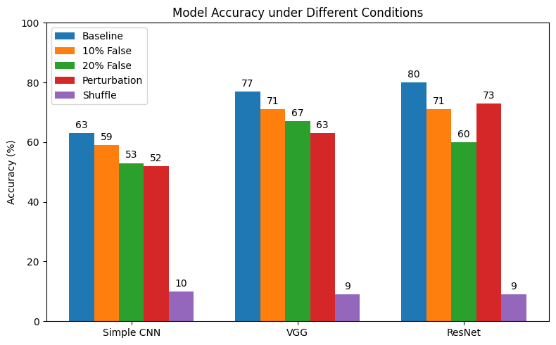

# CIFAR-10 Robustness Exploration

This repository investigates how image classification models perform under various forms of label and input perturbations. The goal is to analyze model generalization when trained with corrupted labels or transformed inputs.

Project for: 4190.408, Artificial Intelligence 2025 Spring, SNU

## 📌 Project Objectives

* Train image classifiers (CNN, VGG, ResNet) on CIFAR-10 using PyTorch.
* Explore how changes to label distribution and input transformations affect model performance.
* Visualize training loss and classification accuracy.
* Analyze class-wise and overall accuracy across different experimental setups.

## 🧪 Experimental Conditions

| Condition Name       | Description                                                                |
| -------------------- | -------------------------------------------------------------------------- |
| Baseline             | Train with original CIFAR-10 labels and unmodified images.                 |
| Random Label Shuffle | Shuffle all training labels randomly, breaking label-image correspondence. |
| Label Noise (10%)    | Randomly corrupt 10% of training labels with incorrect classes.            |
| Label Noise (20%)    | Randomly corrupt 20% of training labels with incorrect classes.            |
| Input Perturbation   | Keep labels intact, but apply strong transformations (e.g. crop, blur).    |

## 🧠 Models

* Simple CNN (LeNet-style)
* VGG-like CNN
* Small ResNet (e.g. ResNet18 with modified depth)


## 📂 Folder Structure

```
.
├── train.ipynb             # Main runtime notebook file
├── train_test.py           # Functions (e.g. train, test, etc.)
├── net.py                  # Network Structure Classes
├── cache/                  # cached CNN, VGG, ResNet models and logs
└── ...
```

## 📈 Visualizations

* Training loss plots per 1000 iterations.
* Accuracy comparisons across experiment conditions.
* Per-class accuracy bar charts.

## 📊 Example Plot
* Training loss curves and accuracy graph

<table>
  <tr>
    <td></td>
    <td></td>
  </tr>
  <tr>
    <td></td>
    <td></td>
  </tr>
</table>

## 📝 Citation

Inspired by:

* Zhang et al. (2017) “Understanding Deep Learning Requires Rethinking Generalization”
* Frankle & Carbin (2019) “The Lottery Ticket Hypothesis”
* Belkin et al. (2019) “Reconciling Modern Machine Learning Practice and the Classical Bias–Variance Trade-Off”

## 🚀 Getting Started

Before starting, if you want to try training on your local environment,

it is recommended to use GPU with CUDA driver, 

and also check for torch version in requirements.txt if it supports your CUDA version.

### 1. Install dependencies:

```bash
pip install -r requirements.txt
```

### 2. Train a baseline model:

* In train.ipynb, run codes sequentially
* or just run codes except training codes. You can skip and load from cache folder 


## 📬 Contact

Feel free to open issues or discussions for questions and ideas.

---
